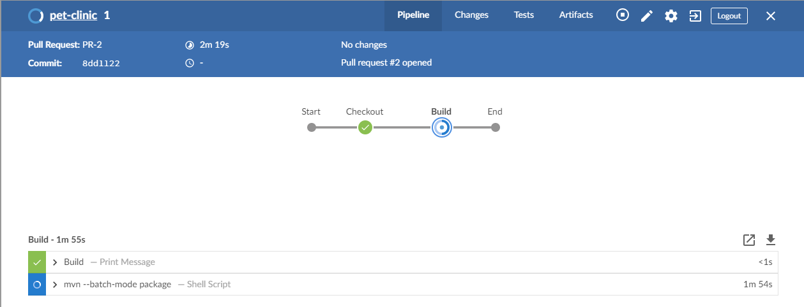

## Continuous Integration runs

Go to Jenkins to see Continuous Integration happening: <a href="https://[[HOST_SUBDOMAIN]]-8080-[[KATACODA_HOST]].environments.katacoda.com/blue/organizations/jenkins/pet-clinic/activity/" target="jenkins">https://[[HOST_SUBDOMAIN]]-8080-[[KATACODA_HOST]].environments.katacoda.com/blue/organizations/jenkins/pet-clinic/activity/</a>

This will take some time to:

* Download the dependencies of the Pet Clinic application.
* Build the application to generate a package.
* Run unit tests.
* Deploy the result to an ephemeral Docker container.

## The mechanics

As the pull request is created, a series of automated actions happen in the
background:

* GitHub notifies Jenkins of the code change thanks to the
  [web hook](https://help.github.com/articles/about-webhooks/), which you can
  see in your repository settings at
  [https://github.com/[your_username]/pet-clinic/settings/hooks](https://[[HOST_SUBDOMAIN]]-9876-[[KATACODA_HOST]].environments.katacoda.com/#hooks).
  A web hook is used to notify other applications about events in the GitHub
  repository, such as a Pull Request being submitted.
* Jenkins reads the content of the
  [`Jenkinsfile`](https://jenkins.io/doc/book/pipeline/jenkinsfile/) at the root
  of your repository. The Jenkinsfile is the file which has the implementation
  of your applications' continuous integration pipeline.
* The stages and steps in the Jenkinsfile are executed on the Jenkins server.

## Tasks

* Review the result of the pipeline: note the "build" step has caught the error
  we introduced in a previous step.
* Click on the step which is in error and review the logs of the error.
