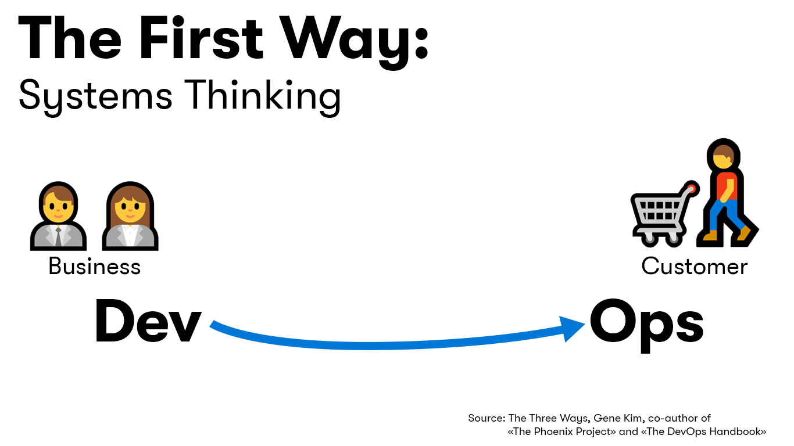
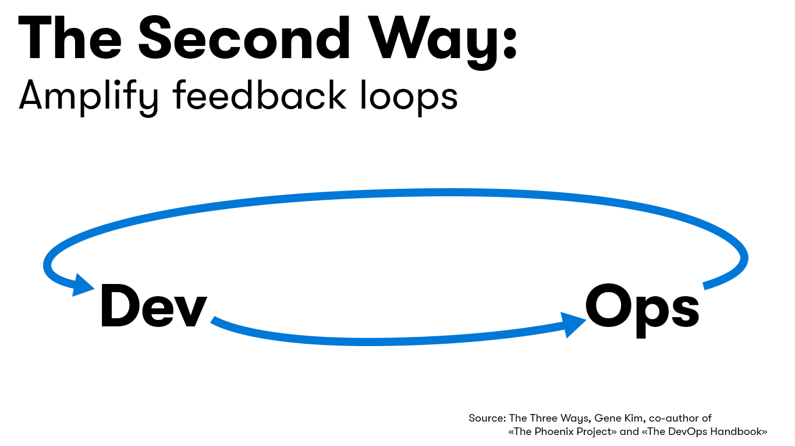
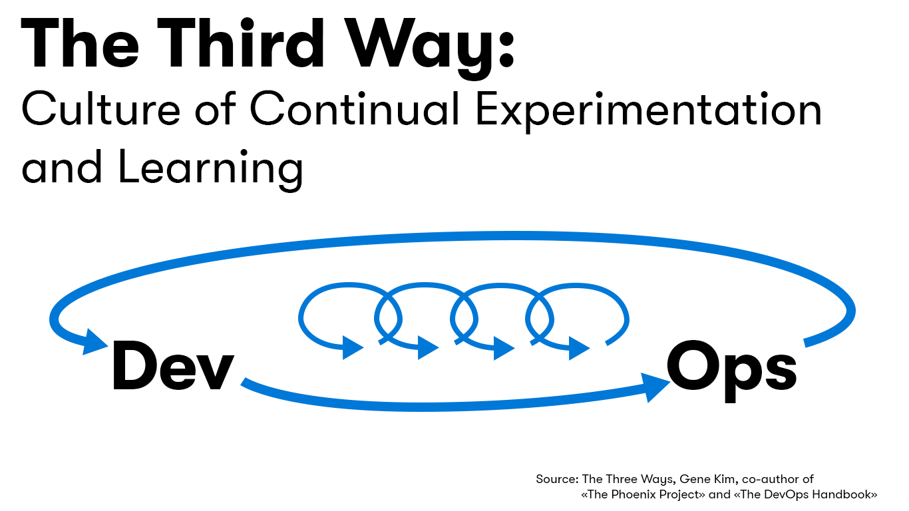

**Charlie** the CEO of the Pet Clinic (serial entrepreneur, multi-industry disruptor and philanthropist) has a keen personal interest in his Pet Clinic business. He views the Pet Clinic business as a natural evolution in the commercial arena of his animal activism activities from his student days. Charlie redirects a large portion of the profits from this venture to animal rescue centers in the communities in which the clinics are located.

Just over a year ago Charlie had some concerns about the long term viability of the Pet Clinic business. He knew changes were needed to better serve a rapidly evolving and dynamic market place, however he felt his team's ability to deliver those changes were being hampered by their development processes, tools and culture. This often resulted in it taking up to 6 months to get a change released to production and releases, when available, that were either buggy or didn't meet the requirements of the business.

Struggling to square the circle and unsure how to proceed, he came across a talk on DevOps entitled [Why we need DevOps? - by Gene Kim](https://www.youtube.com/watch?v=877OCQA_xzE) online. Charlie was struck by the elegant simplicity of the 3 ways of DevOps.

* The **First Way** which aims at maximizing throughput of the entire system, as opposed to the throughput of a specific silo of work or department.

* The **Second Way** about creating the right to left feedback loops. The goal being to shorten and amplify feedback loops so corrections can be continually made.

* The **Third Way**  involves creating a culture that fosters continual experimentation and understanding that repetition and practice are the prerequisites to mastery.

Researching further:

* Reading **The DevOps Handbook** and **The Phoenix Project** books

* Studying the [State of DevOps report](https://puppet.com/resources/whitepaper/state-of-devops-report)

further convinced him about the potential of DevOps and of its applicability in support of his business philosophy.

_*"Always be prepared to disrupt your business, otherwise a competitor will disrupt it for you".*_

This philosophy served him well in his many business interests which include newspapers, online retailing, space exploration and the pet clinics.

💡 **TIP**: Adjust the window size vertical scroller to make the welcome module easier to read ◀▶.

