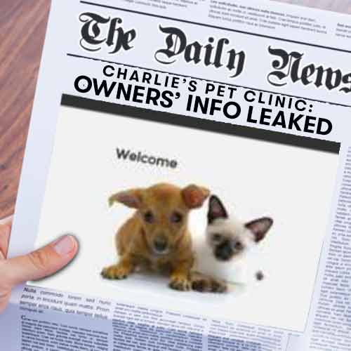

We join our intrepid crew in the midst of a fire drill, red light floods the teams co-located office space in a digital hub, sirens can be heard in the background, together with a robotic voice regularly repeating "**We have been hacked, this is not a drill ...**".

A security breach, specifically a [SQL (pronounced "see-kwuhll") Injection Vulnerability](https://en.wikipedia.org/wiki/SQL_injection), has been identified following Hal the hacker's activities.

A SQL Injection vulnerability gives a hacker the ability to compromise the SQL queries that an application sends to it's back-end database. This is one of the most serious vulnerabilities that a business can face because it can result in a hacker getting access to the sensitive information stored in the application's database such as usernames, passwords, names, contact details, and even credit card details.

> We need to fix the immediate vulnerability, and also put a process in place to prevent a repeat hack is to be the teams number 1 priority for the forthcoming sprint. Look, we are even in the local news!

> Yes, we have investigated the issue and created stories in the backlog with detailed acceptance criteria to enable the planned Shift Left on Security.

> We have created stories that encompass Static Application Security Testing (SAST) and Dynamic Application Security Testing (DAST). SAST involves testing of the source code, binary or byte code of an application. It doesn't need a running system. DAST involves testing an application while it is running. DAST doesn't require access to the source code or the binaries.

> We have formed a [Swarm team](https://www.infoq.com/news/2013/02/swarming-agile-teams-deliver) to work the stories. We have a small team of domain experts, Adam (SRE), Dan (Developer), Selma (Security), and Tina (Tester) gathered together for a short period to solve a problem or deliver some key functionality as expeditiously as possible.

> This is a high visibility issue so - acting as the servant leader - I will have a key role to protect the team from all the 'noise' around the hack to better enable them to focus on the problem at hand.

This is **Shift Left on Security**.
