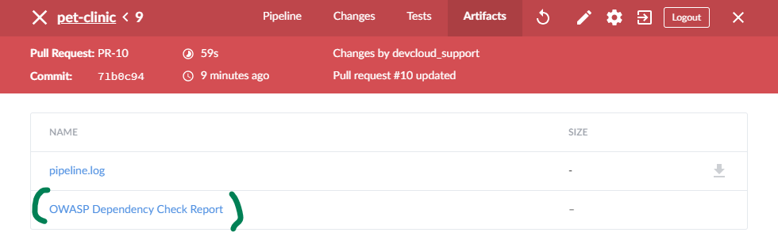

> Now, we need to update the `Jenkinsfile` which describes our Continuous Integration pipeline to add the dependency vulnerability scanner. Initially, I don't want to fail the build because of vulnerabilities in our dependencies. We want to stop the leak and be informed instead. I will mark the build as "unstable" if we have a vulnerability.
> Also, I am gathering a report for the vulnerabilities so that we can analyze it.

## Steps

* Navigate to your copy of the Pet Clinic application to find
  [`Jenkinsfile`](https://[[HOST_SUBDOMAIN]]-9876-[[KATACODA_HOST]].environments.katacoda.com/#jenkinsfile),
  in the same `deps-check` branch from the pull request.
* Click on the pencil icon in the top right corner to edit the file.
* Add the following stage just above Build stage:
<pre class="file" data-target="clipboard">

            stage('Dependency check') {
                steps {
                    sh "mvn --batch-mode dependency-check:check"
                }
                post {
                    always {
                        publishHTML(target:[
                            allowMissing: true,
                            alwaysLinkToLastBuild: true,
                            keepAll: true,
                            reportDir: 'target',
                            reportFiles: 'dependency-check-report.html',
                            reportName: "OWASP Dependency Check Report"
                        ])
                    }
                }
            }

</pre>
* Commit in `deps-check` branch.
* The pipeline will trigger automatically.
* Navigate to <a href="https://[[HOST_SUBDOMAIN]]-8080-[[KATACODA_HOST]].environments.katacoda.com/blue/organizations/jenkins/pet-clinic/activity" target="jenkins">Jenkins</a>
  to see the results. The pipeline will be marked "failed": read the logs of the stage
  "Dependency check", then click on Artifacts tab on the top right to see the OWASP report.

  
Blue Ocean view

* You may also switch to Jenkins' classic view. Click on "Go to classic"
  
  logo in the upper right corner. Select the "pet-clinic" pipeline, choose "Pull
  Requests" and select the latest build from the Build History along the left
  side to get to a Jenkins view that matches the below images.  
  The build will be marked "failed". Read the logs of the stage "Dependency
  check" and the OWASP report to see what the issue is.

 
Classic view

