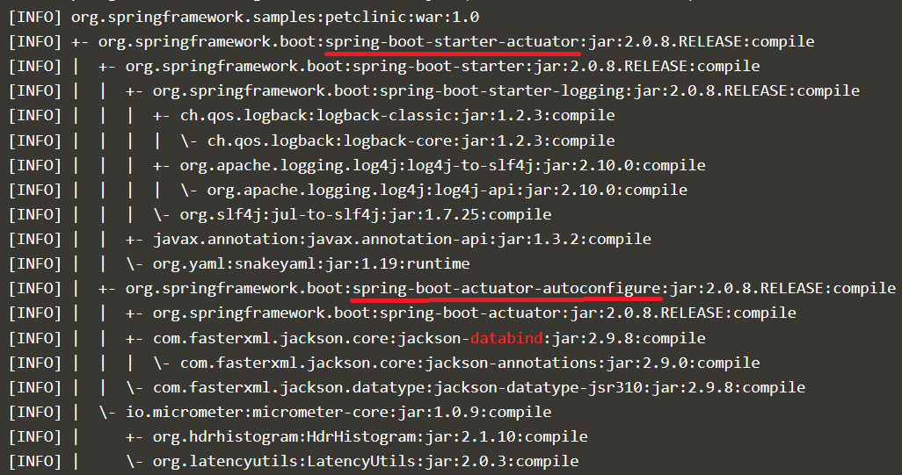

> According to the OWASP scan, at least the `spring-boot-starter-cache-1.4.7` dependency has a critical vulnerability ([CVSS>7](https://www.cvedetails.com/)). 
> I'm glad we find this now before it gets exploited!

> That's right, even if the application you build is secure, you have to watch the entire ecosystem, continuously. 
> The custom code you build is harder for me to penetrate because it's... custom. 
> But, the operating system, libraries, and all the other dependencies that the application relies upon are an easier target for me: 
> I can find information on the internet to exploit newly discovered vulnerabilities.

> The `spring-boot-starter-cache-1.4.7` dependency is in the `pom.xml` file. 
> I remember we had to "pin" (stick to) this version previously, but we fixed the issue some time back. 
> Let's update to the latest version.

## Steps

* Navigate to your copy of the pet clinic application to find  [`pom.xml`](https://[[HOST_SUBDOMAIN]]-9876-[[KATACODA_HOST]].environments.katacoda.com/#pomfilebranch), in the same `deps-check` branch from the pull request
* Click on the pencil icon in the top right corner to edit the file
* Locate the `spring-boot-starter-cache` dependency, and remove the line with `<version>`.
* Commit the change in this `deps-check` branch, in the context of the pull request
* The build will trigger automatically
* Navigate to [Jenkins](https://[[HOST_SUBDOMAIN]]-8080-[[KATACODA_HOST]].environments.katacoda.com/blue/organizations/jenkins/pet-clinic/activity) to see the results of the build
* This time, the OWASP check should come out with no error: everything good! ✔

---
## The pipeline still fails?

> As Hal said, new vulnerabilities are found all the time. It can be that a 
> new vulnerability has been found since we last updated the Pet Clinic 
> application. It may be difficult to find which dependency to update in the `pom.xml` file
> if it is a dependency of a dependency that is vulnerable.

At this point you have resolved the vulnerability we wanted you to resolve. 
If there are additional vulnerabilities identified you either fix them using 
the process which follows or you can ignore any additional items and proceed 
with the rest of the module.

You will need to walk the dependency tree. Let's first go to the correct branch in the repository:
* Go to the terminal window
* `cd ~/pet-clinic`{{execute}}
* `git pull`{{execute}}
* `git checkout deps-check`{{execute}}

Now let's look at the dependency tree:
* `mvn dependency:tree`{{execute}} (or `mvn dependency:tree | egrep --color=auto 'my-vulnerable-dep|$'` to highlight "`my-vulnerable-dep`")
* Look for the dependency that has been identified as vulnerable in the OWASP dependency check report.
* Walk up the tree and find the library which includes the vulnerable dependency. In this example, `databind` is vulnerable:

* In this example, you need to locate `spring-boot-actuator-autoconfigure` in `pom.xml` or update an higher level dependency.
* Go to https://mvnrepository.com/ to find a new version of that library. Using the smallest minor revision is always preferred to not destabilize the code. That said, automated tests provide a good safety.
* Update the `pom.xml` file with the new version - `nano pom.xml`{{execute}}
* Push the updated version:
  * `git add pom.xml`{{execute}}
  * `git commit -m "Fix dependency"`{{execute}}
  * `git push`{{execute}}
* Check the execution of the pipeline and the results.
* Repeat until dependency check is green.
