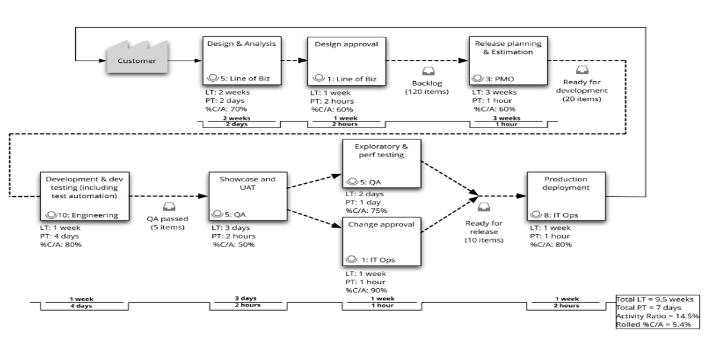

**Learner**

Here is the VSM which the Pet Clinic team have agreed represented their E2E software development process

>> What activity in the VSM has worst %C/A? <<
( ) Change Approval
(*) Showcase and UAT
( ) Design and Analysis
( ) Development & dev testing (including test automation)
