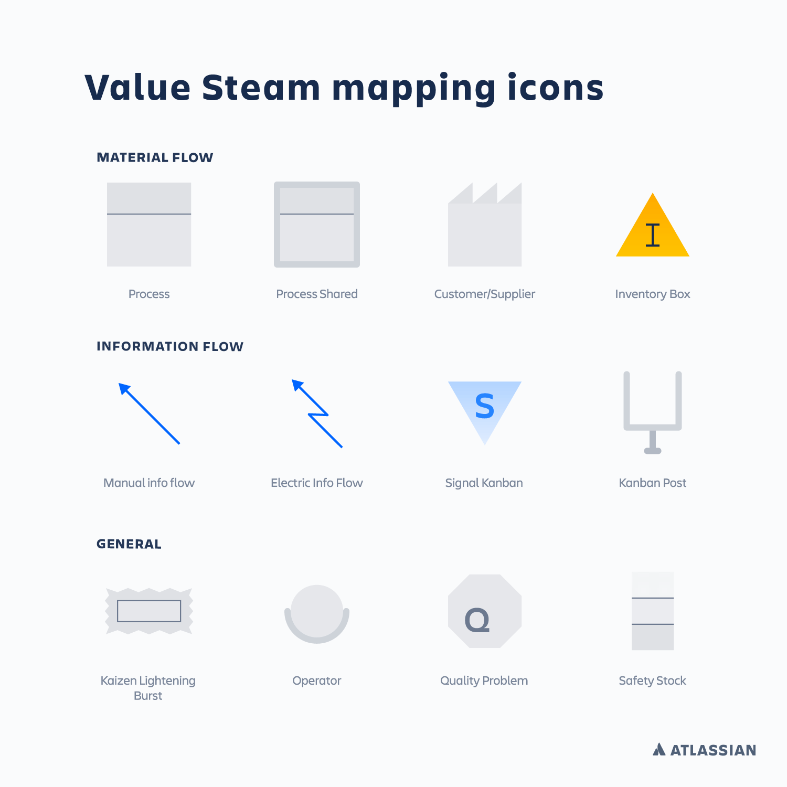

There are some points to note about the VSM

The symbols on the VSM are a standard set of symbols  

Please take some time to review the Pet Clinic Software Development Process, specifically where and how the symbols have been used in the mapping of the process.

As well as describing the flow, including branches and loops, for each step in the process the team have captured the following metrics

**LT: Lead Time**. LT is the time it takes a work item to leave the previous step to when it leaves the current step. LT includes both the time during which value is being added to the the work item, processing time and idle time when no work is being done on the item.

**PT: Processing Time**. PT is the time in the step when a work item is being productively processed.

%**C/A: Percent of Complete/Accurate Work Items**. % C/A is the percent of Complete/Accurate work items received in the current step from the previous step.

Capturing these metrics in the current state VSM will help the team understand the areas jeopardizing fast flow, short lead times and reliable outcomes, and thus guide the team toward identifying the desired improvements.

fade out ... 