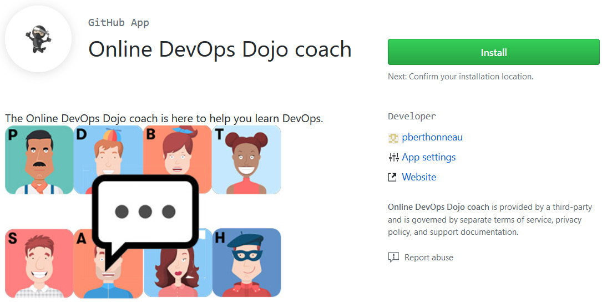

Throughout the modules, you will interact with the virtual team, in the
context of issues or pull requests. This is done through a [GitHub Application](https://developer.github.com/apps/about-apps/)
which you need to "install" in your pet-clinic repository.

* Go to the Online DevOps Dojo coach web site: <https://github.com/apps/online-devops-dojo-coach>

* Click "Install".
* If your account belongs to organization(s), you will see a first page
"Where do you want to install Online DevOps Dojo Coach?", select your user profile.
* In "Install on your personal account [...]" click "Only select repositories" and select `your-github-username/pet-clinic`.
* Scroll down and click "Install".

You will get a confirmation at the top of the browser:
"**Okay, Online DevOps Dojo coach was installed on the @your-github-username account**".
