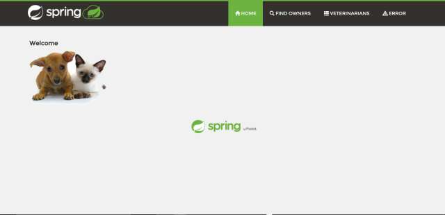

This is a story of a business, a team, an application and its delivery chain (their continuous delivery pipeline).

The team is part of the IT organization of a large Pet Clinic. The Pet Clinic runs its business on a Java application. The application includes features to manage a list of clients (pet owners), their pets, and a list of veterinarians with their specialties.

The Pet Clinic IT team develops, tests, deploys and supports the Java application.

💡 **TIP**: Adjust the window size vertical scroller to make the welcome module easier to read ◀▶
